<h1 id="top"> Active Directory: Basic Tasks </h1>

We’ll perform some beginner-friendly but essential Active Directory tasks inside the lab environment that we had created in our Lab-Setup file. 
If you haven't completed that, I recommend starting there first. [Lab Setup Guide](../Lab-setup.md)

We’ll be working inside our Windows Server 2019 virtual machine and our Windows 10 client machine, both of which should already be part of the same domain.

---

## 📜 Table of Contents

- [📁 Step 1. Create Organizational Units (OUs)](#-create-organizational-units)
- [👤 Step 2. Create User Accounts](#-create-user-accounts)
- [👥 Step 3. Create Security Groups](#step-1)
- [🔗 Step 4. Add Users to Groups](#step-2)
- [🧠 Step 5. Move CLIENT01 into the Appropriate OU](#step-3)
- [🖥️ Step 6. Create and Link a GPO](#step-4)
- [🧪 Step 7. Test the GPO](#step-5)

---

## 📁 Step 1. Create Organizational Units (OUs)

OUs (Organizational Units) help organize users, groups, and computers into logical containers. You’ll start by creating two OUs: one for IT Support and one for HR.

1. Open **Server Manager** → **Tools** → **Active Directory Users and Computers**.

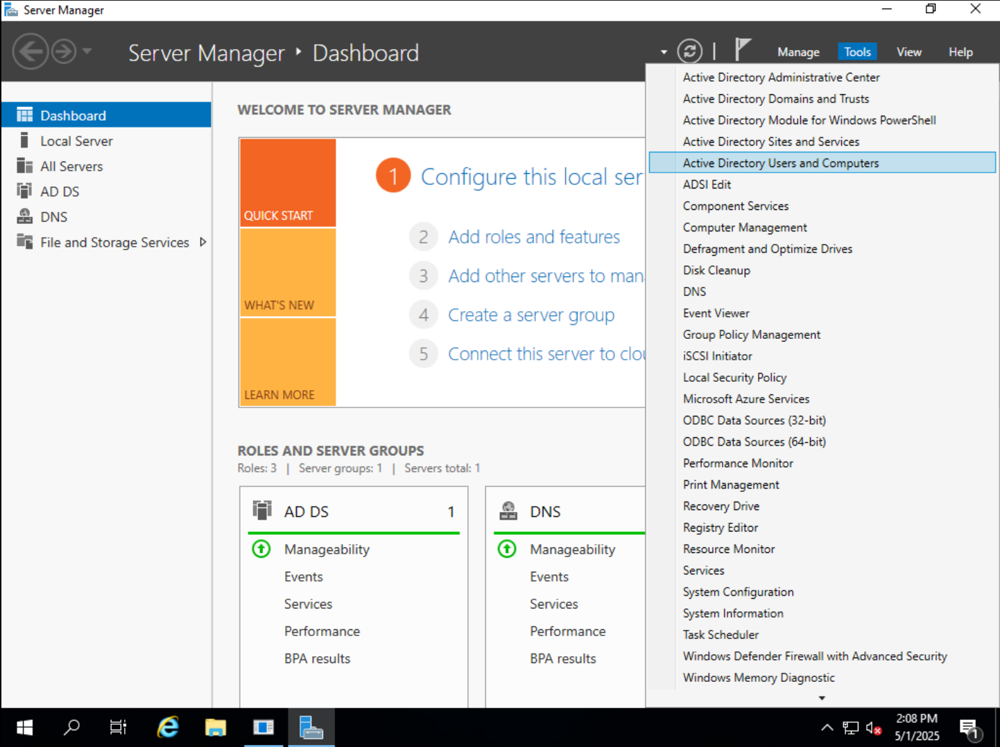

2. In the left panel, expand your domain (`corp.local`).
3. Right-click `corp.local` → **New** → **Organizational Unit**.

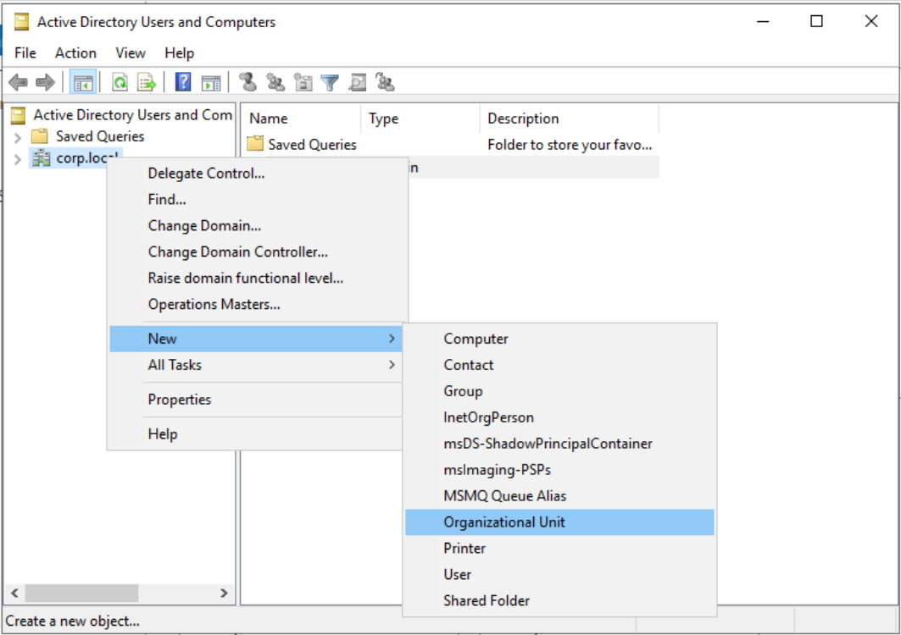

4. Name it: `Departments`, and click OK.
   - 🔒 **Best practice**: Leave **"Protect container from accidental deletion"** checked. For *lab* purposes, however, its your choice.

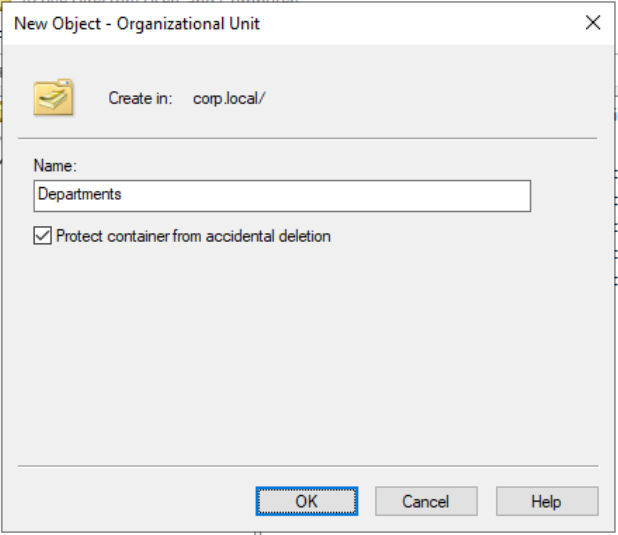

5. Right-click `Departments` → **New** → **Organizational Unit** again.
   - 💡 **Tip**: You can also left click `Departments` and right-click in the detail window to bring up the menu. I'll show you in the screenshot.

6. Use this process to create two sub-OUs:
   - `HR`
   - `ITSupport` 

  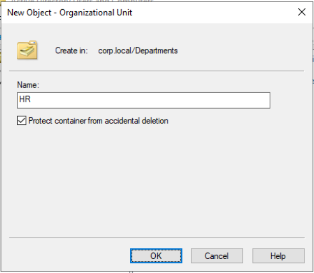
  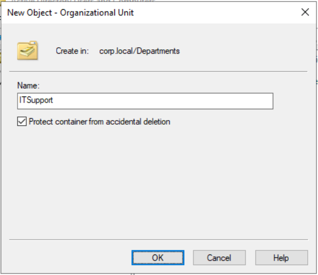   

🎉 You now have a clean structure for organizing your user accounts and departments.

[🔝 Back to Top](#top)

---

## 👤 Step 2. Create User Accounts

Let’s create one user for each department.

1. In **Active Directory Users and Computers**, right-click `HR` → **New** → **User**.
   - 💡 **Tip**: Remember, you can also left click `HR` and right-click in the detail window to bring up the menu. 

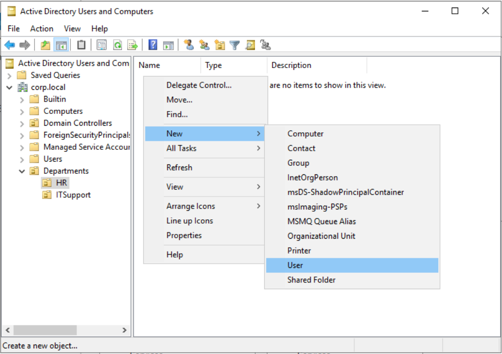

2. Use these details:
   - **First name**: `John`
   - **Last name**: `Smith`
   - **User logon name**: `jsmith`
3. Click `Next`.

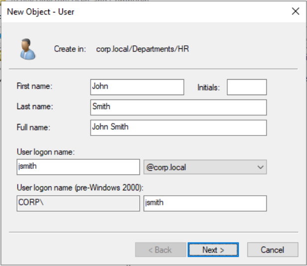

4. Set a password.
   - Don't forget this one. Maybe write it down this time...
   - 🔒 **Best practice**: Leave “User must change password at next logon” checked. This is a security habit used in real-world environments.
     
5. Click `Next`, then click `Finish`.

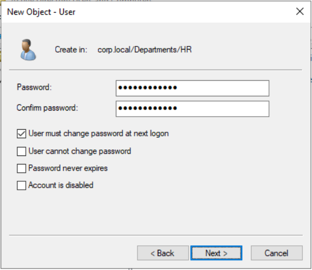

6. Repeat for the `ITSupport` OU:

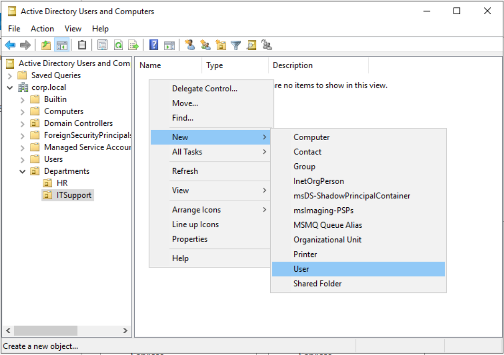

7. Use these details:
   - **First name**: `Jane`
   - **Last name**: `Doe`
   - **User logon name**: `jdoe`
8. Click `Next`.

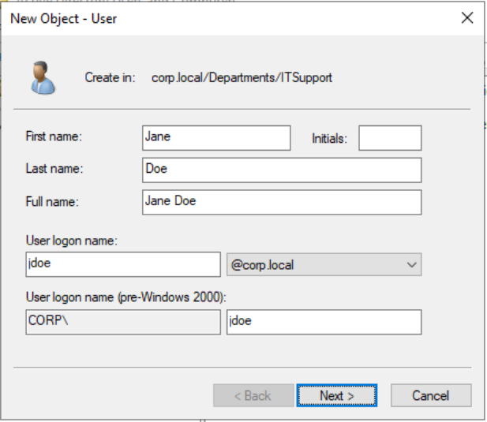

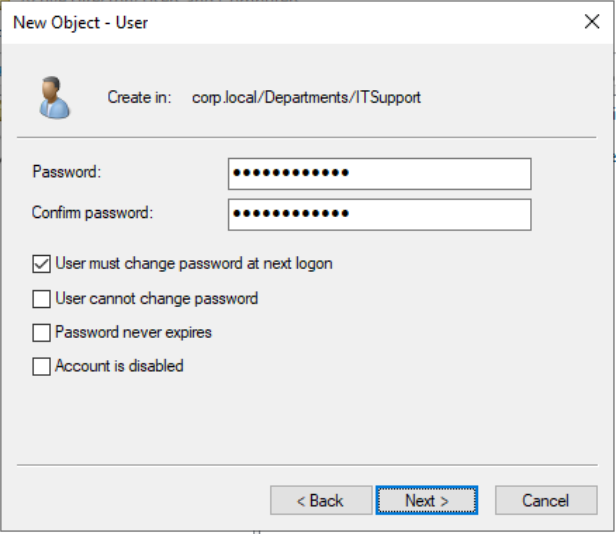

🎉 This is all for create users one by one.

[🔝 Back to Top](#top)

---

## 👥 Step 3. Create Security Groups

Groups are used to manage permissions or apply policies to multiple users at once. Let's create some groups!

1. In **Active Directory Users and Computers**, right-click `HR` → **New** → **Group**.

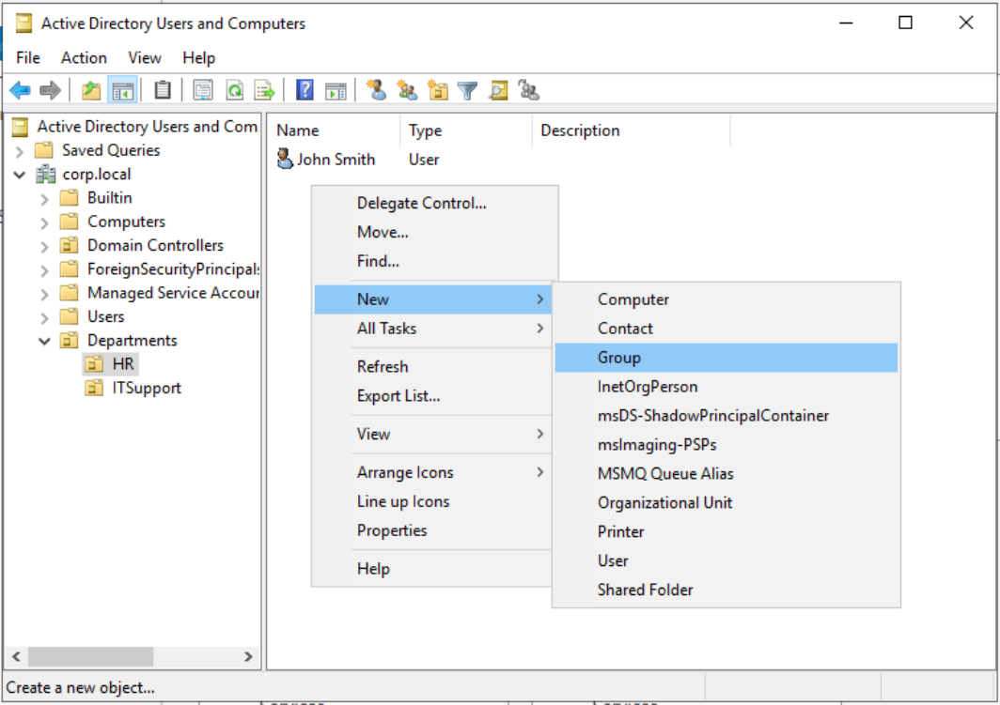

2. Use these details:
   - Group name: `Managers`
   - Group scope: `Global`
   - Group type: `Security`
4. Click `OK`.

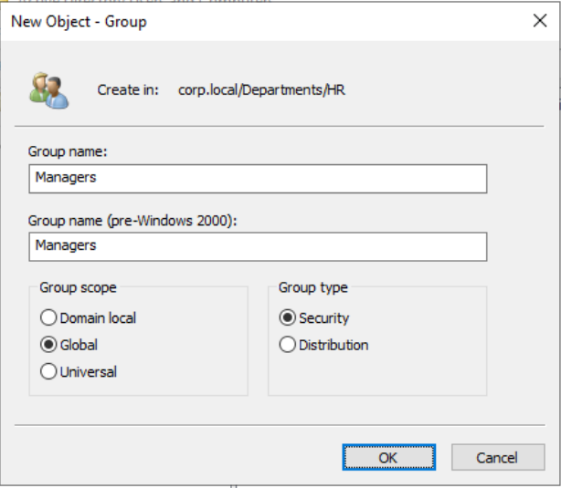

🧑‍💻 Repeat for `ITSupport`:

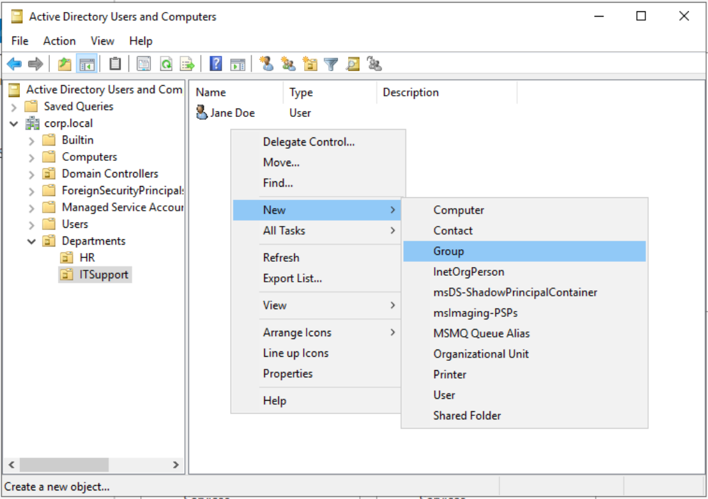

- Use these details:
   - Group name: `HelpDesk`
   - Group scope: `Global`
   - Group type: `Security`
- Click `OK`.

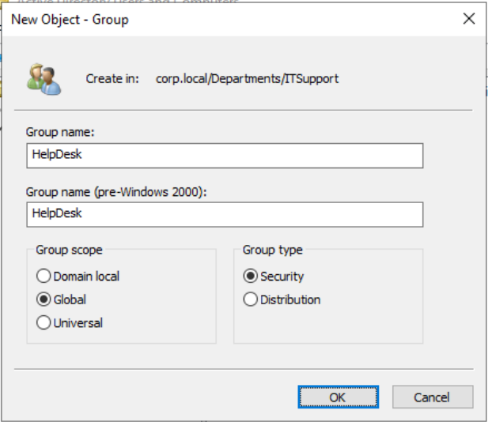

[🔝 Back to Top](#top)

---

## <h2 id="step-2"> 🔗 Step 4. Add Users to Groups </h2>

Let’s assign our users to their department groups.

1. Still in **Active Directory Users and Computers**, double-click `jsmith` in the `HR` OU.

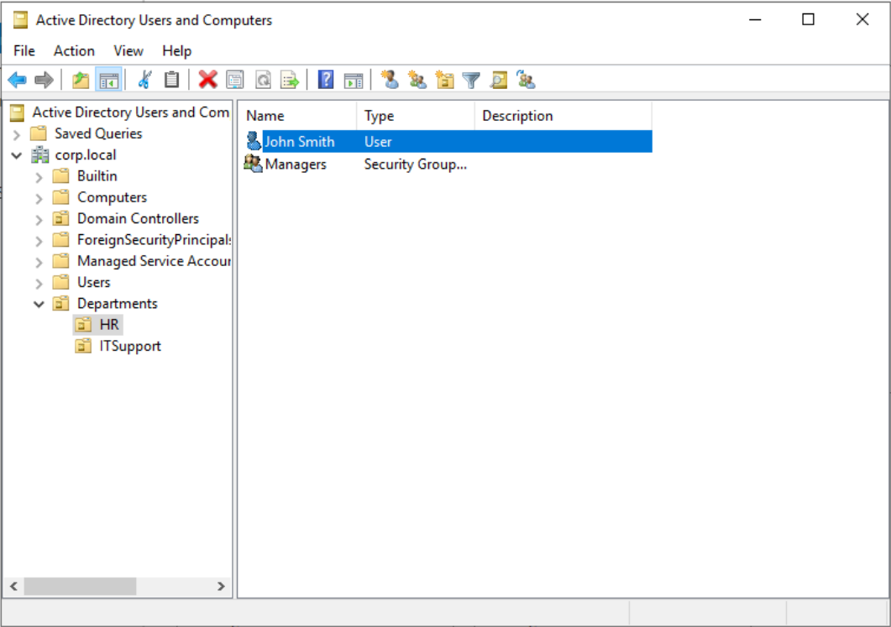

2. Go to the **Member Of** tab, then click `Add...`

3. Type `Managers`, click `Check Names`, then click `OK`.

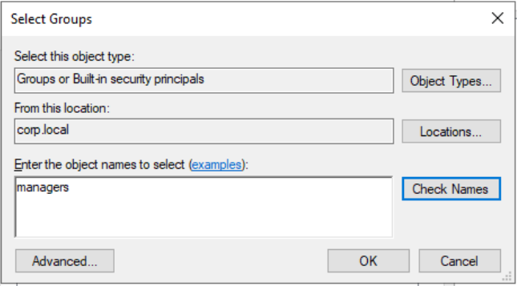

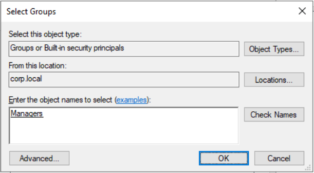

4. Click `OK` to close **John Smith Properties** window.

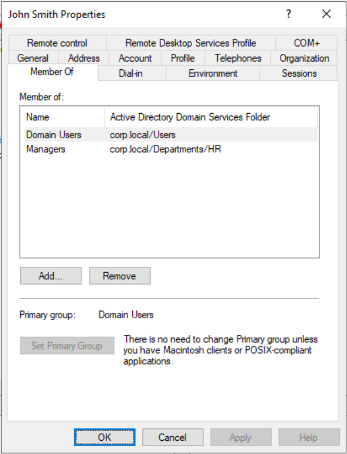

🧑‍💻 Do the same for `jdoe` in `ITSupport`:

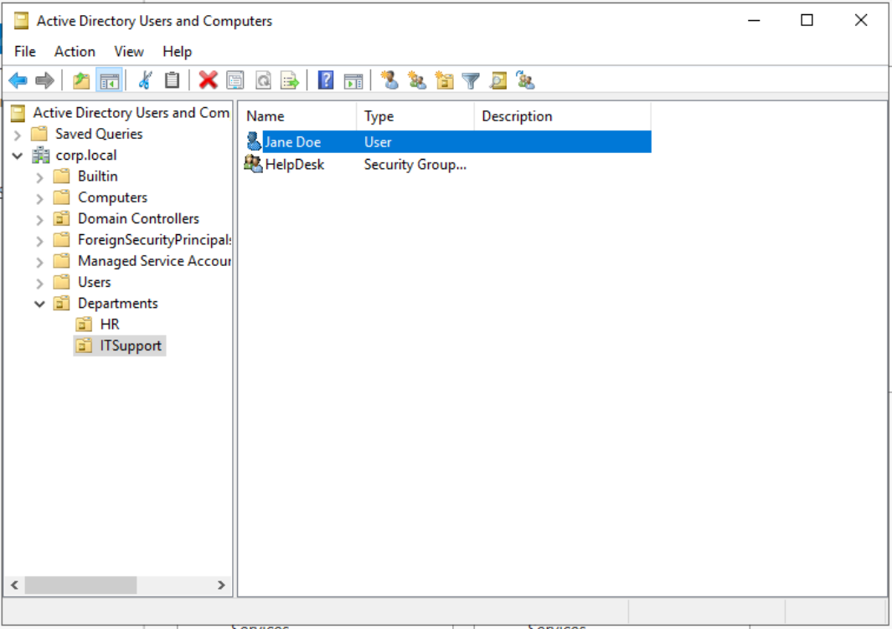

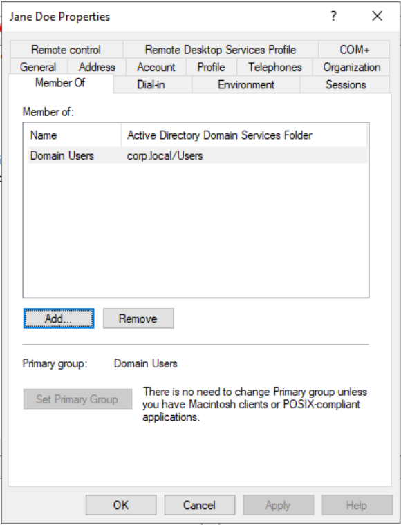

- Add `jdoe` to `HelpDesk`.

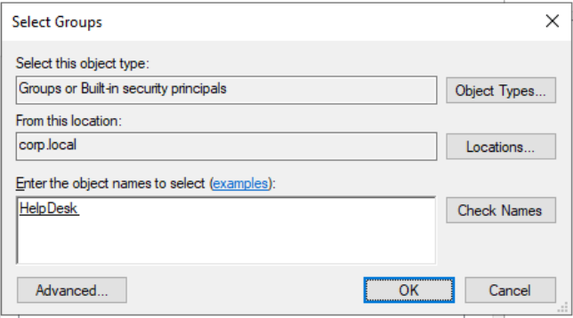

[🔝 Back to Top](#top)

---

## <h2 id="step-3"> 🖥️ Step 5. Move CLIENT01 into the Appropriate OU </h2>

To make sure GPOs apply correctly, you need to move your client machine (`CLIENT01`) into the OU you're working with.
Follow these steps:

1. In **Active Directory Users and Computers**, expand your domain (`corp.local`) and click on **Computers**.

2. In the right panel, right-click `CLIENT01`, the click `Move...`.

3. Choose the `HR` OU
4. Click `OK`.

✅ **Why this matters:** GPOs targeting computers will only work if the computers are in the right OU. 

[🔝 Back to Top](#top)

---

## <h2 id="step-4">  🧠 Step 6. Create, Link, and Push a GPO </h2>

We’ll now create a **Group Policy Object (GPO)** that displays a message when users log in. This will help confirm the GPO is working.

1. Open **Server Manager** → **Tools** → **Group Policy Management**.

2. Expand `corp.local` → `Departments`.
3. Right-click `HR` → **Create a GPO in this domain, and Link it here...**

4. Name it: `HR Login Message`, then click OK.

5. Right-click the new GPO under `HR` and click `Edit`.

6. In the **Group Policy Management Editor**, navigate to:
   - **Computer Configuration** → **Policies** → **Windows Settings** → **Security Settings** → **Local Policies** → **Security Options**
7. Find and double-click **Interactive logon: Message title for users attempting to log on**.

8. Set the title to 'HR Notice' and click `OK`.

9. Find and double-click **Interactive logon: Message text for users attempting to log on**.

10. Set the message to 'This system is for HR use only.' and click `OK`.

11. In the left panel, right-click `HR` and click **Group Policy Update...**
   - 💡 This pushes the GPO update remotely to all computers in that OU — including `CLIENT01`.

✔️ This message will now show every time a user logs into CLIENT01.

🎉 Now we're ready to test!

[🔝 Back to Top](#top)

---

##<h2 id="step-5"> 🧪 Step 7. Test the GPO </h2>

Now let's test that the login message works.

1. Power on `CLIENT01`, or restart if it's already running.

2. You should see the login message!

🎉 That’s it! The GPO is working.

[🔝 Back to Top](#top)

---
