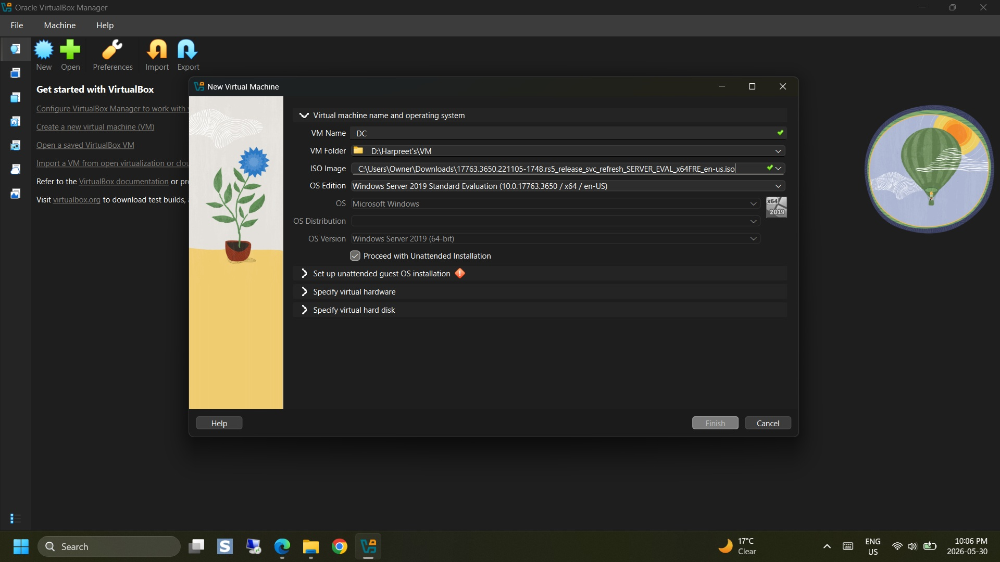
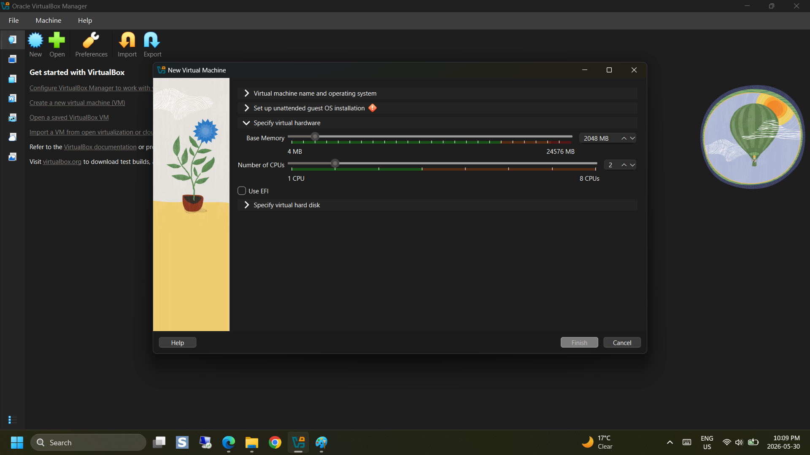
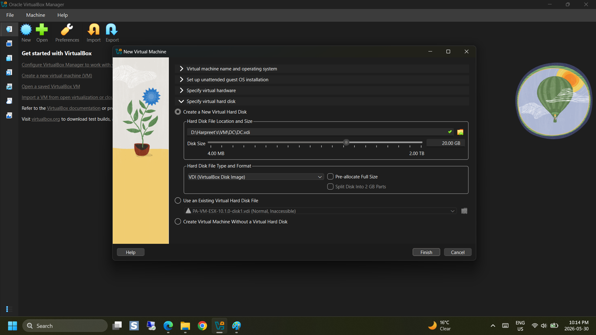
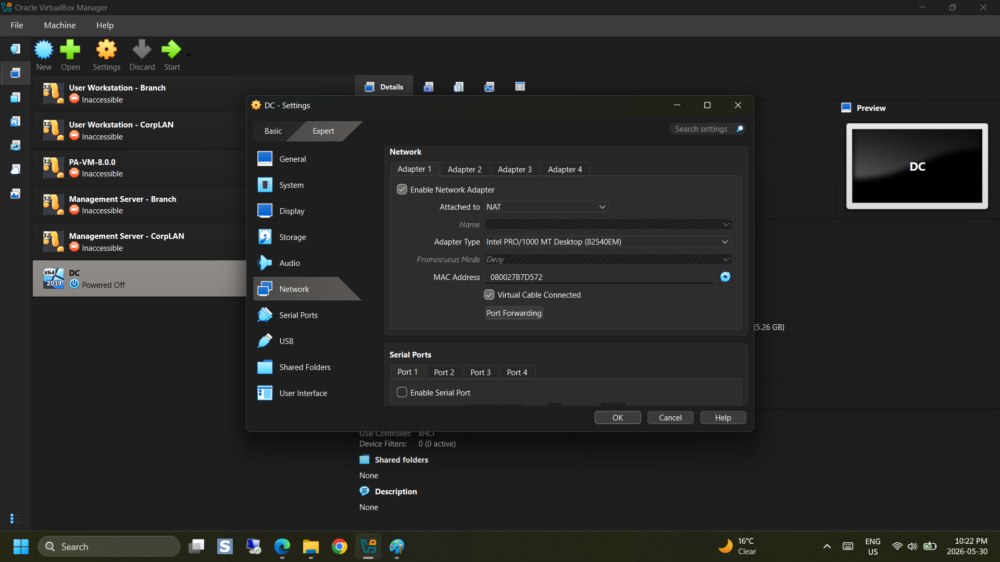
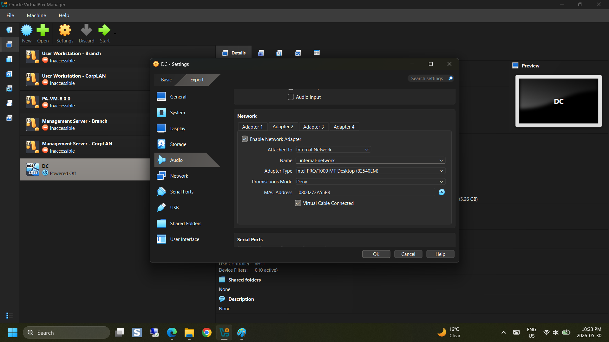
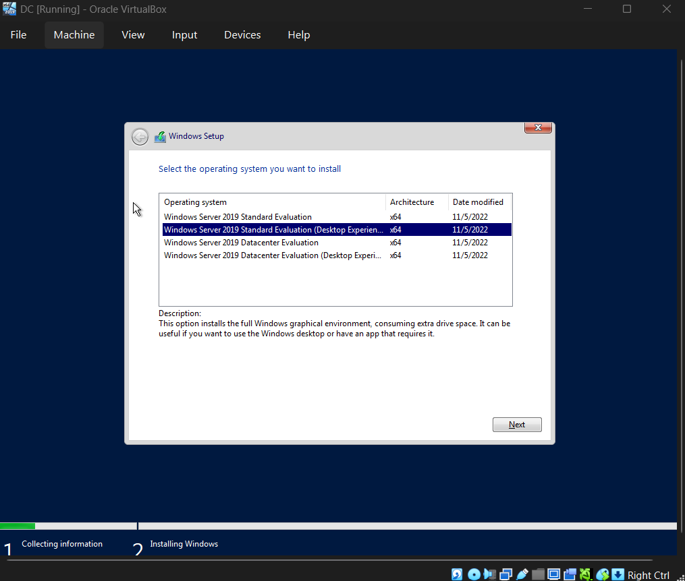
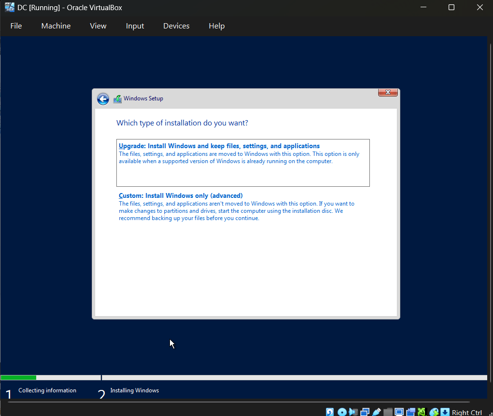
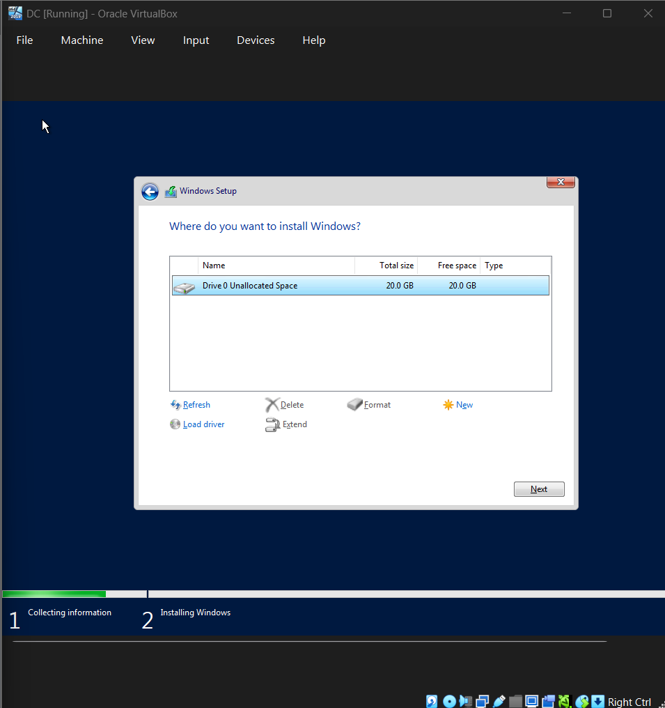
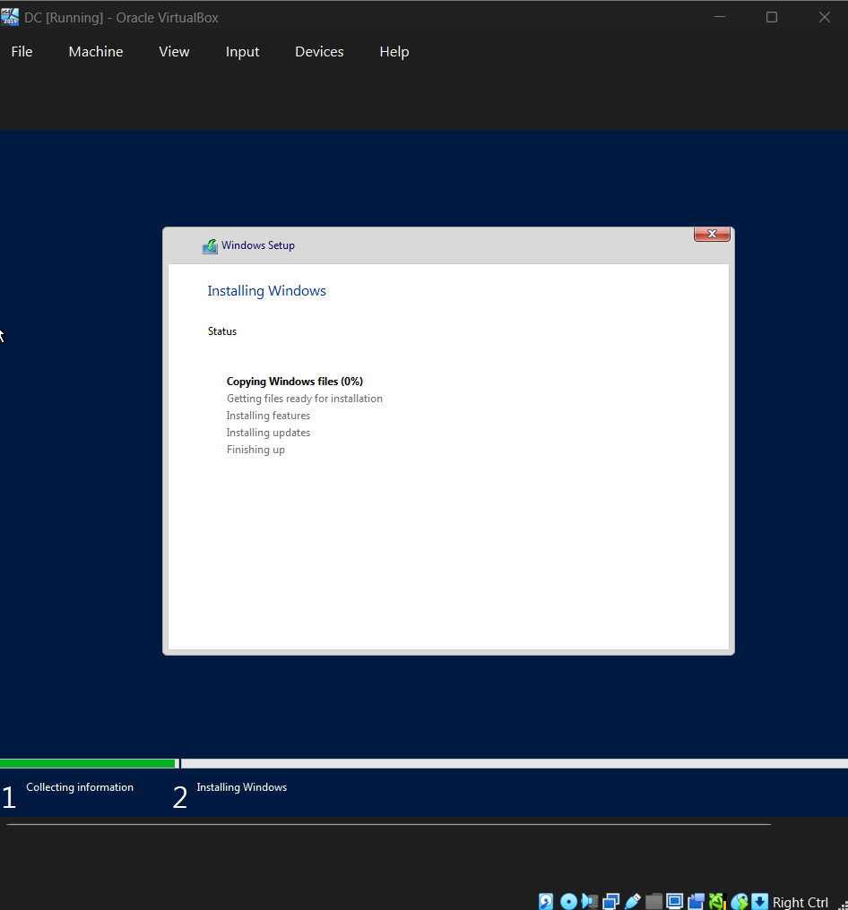
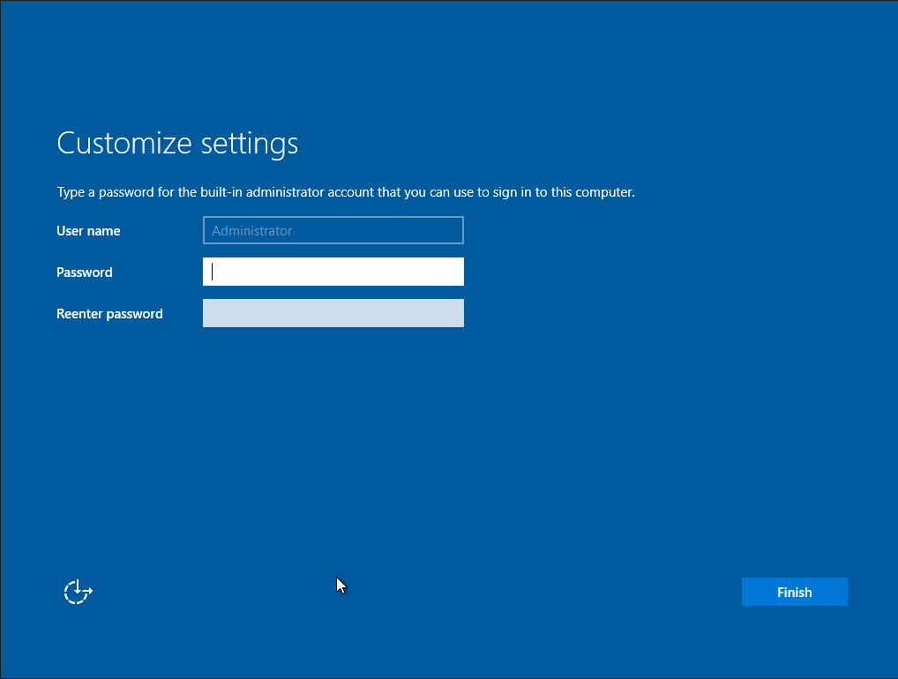

<h1 id="top"> Active Directory Lab Setup Guide (VirtualBox) </h1>
This step-by-step guide will walk you through building your own Active Directory lab from scratch using VirtualBox. You'll create two virtual machines: a Domain Controller (Windows Server 2019) and a Client Machine (Windows 10 Pro), configure them, join the domain, and get everything set up for hands-on Active Directory tasks.
---
##<h2 id="table-of-contents"> 🗂️ Table of Contents </h2>

- [⚙️ VirtualMachine Installation](#vm-installation)
- [Domain Controller (DC01)](#domain-controller)
  - [🛠️ Virtual Machine Setup](#virtual-machine-setup)
  - [💽 Windows OS Installation](#windows-os-installation)
  - [🌐 Network and AD Configuration](#network-and-ad-configuration-dc01)
- [Client Machine (CLIENT01)](#client-machine-client01)
  - [🛠️ Virtual Machine Setup](#virtual-machine-setup-client01)
  - [💽 Windows OS Installation](#windows-os-installation-client01)
  - [🌐 Network Configuration](#network-configuration-client01)
  - [🧑‍💻 Join CLIENT01 to the Domain](#join-client01-to-the-domain)

---
## <h2 id="vm-installation"> ⚙️ VirtualMachine Installation </h2>

1. Download Virtual Machine (https://www.oracle.com/virtualization/technologies/vm/downloads/virtualbox-downloads.html) from the official Oracle site.
2. Right click and run the installer as administrator.
3. Leave the default installation settings unless you have specific reason to change them.
4. Complete the installation and reboot if prompted.
5. Run Virtual Machine normally. 
---

## Creating Domain Controller (DC) 
--- 
##<h2 id="virtual-machine-setup"> 🛠️ Virtual Machine Setup </h2>

### 1. Create the Virtual Machine (VM)
- Open **Virtual Machine**.
- Select **Create a New Virtual Machine**.
  
![Create a New Virtual Machine]
- Name the virtual machine **DC**, choose the location.
- Choose **OS: Microsoft Windows** → **Version: Windows Server 2019**.

- Hardware Customization: 
**Base Memory**: 2048 MB (2GB) recommended, but the default may work fine depending on your system.
- **Number of CPUs**: 2

-Create a Virtual Hard Disk:
 **Hard Disk Type**: Virtual Disk Image

- **Network Adapters**:
  - Leave the default NAT adapter.
  - Click 'Add'.
 

  - Under **Adapter 2** tab, select **Internal Network**

- Click 'Okay'

  **We have just created our first virtual machine! 🎉**

[🔝 Back to Top](#top)

---

##<h2 id="windows-os-installation"> 💽 Windows OS Installation </h2>

### Installing Windows Server 2019
- Power on **DC**.
- When prompted to **Press any key to boot from CD or DVD**, press any key. 
  - If you see the screen babbling about EFI, just restart the VM and maybe pay attention next time.
- Choose **Window Server 2019 Standard (Desktop Experience)**, then click 'Next'

- Accept the license terms, click `Next`.
- Choose **Custom: Install Windows only (advanced)**.

- Select drive and click `Next`.

- Now, it will take some time to install the window

- Set a strong local administrator password, then click 'Finish'.

- Once installed, log in.
  - Click `Send Ctrl+Alt+Del to this virtual machine`.
  - Log in. 

